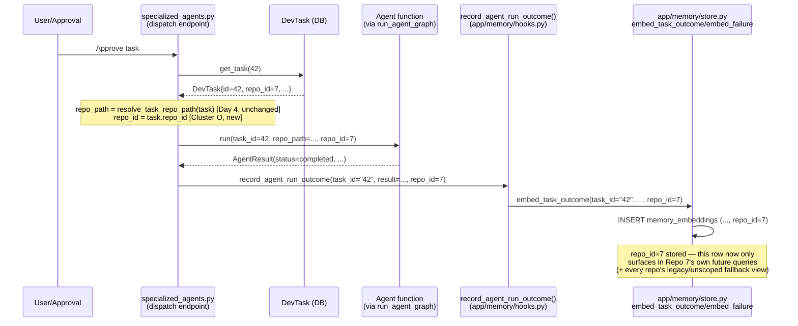
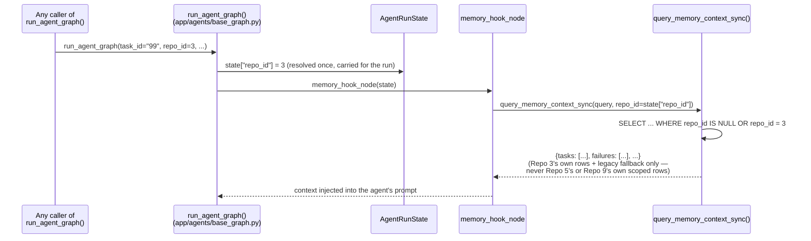
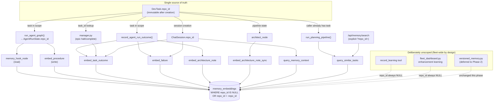

# Cluster O — Repository-Scoped Memory: Architecture Design Proposal

**Status:** Phases 1a, 1b, 1c, and 1d all **PRODUCTION VERIFIED** (2026-08-05, §§12-15). Every
phase from §7's original rollout plan is now implemented and verified. **Cluster O is closed except
for defect fixes** — the canonical reference for future contributors is now
`docs/adr/006-repository-scoped-memory.md`; this document remains the detailed historical record
(diagrams, full Q&A, per-phase test evidence).
**Date:** 2026-08-05 (design), 2026-08-05 (all 4 sub-phases implemented + verified same day)
**Author:** Stage 4 continuation (Cluster O promoted from Q95, 2026-08-04)
**Supersedes nothing** — extends gap-closure Day 2-4 (2026-07-30), which built the schema and the
query-side filtering this proposal now wires up on the write/read call-site side.

---

## 0. Executive summary

The schema, the FK relationships, the indexes, and the SQL-level filtering logic for repository-
scoped memory **already exist and are already correct** (migration 024, `app/memory/store.py`'s
`repo_id` parameters on every `embed_*`/`query_*` function). What's missing is narrower than the
original "propagate `repo_id` through ~20 files" framing suggested: **8 real call-site change
points**, 2 of which are shared chokepoints already used by the majority of the fleet. This is a
wiring problem with a well-understood, low-risk shape — not a new subsystem.

The one real architectural decision this proposal makes is **which categories of memory should be
repo-scoped at all** — task outcomes, failures, architecture notes, and procedures should be;
fleet-wide agent-learning signals (what a tool/prompt pattern taught the fleet about itself,
independent of any target repo's code) should deliberately stay unscoped. Blindly scoping
everything would break cross-repo learning transfer, which is the entire point of that category.

---

## 1. Current state — verified, not assumed

### 1.1 What already exists (schema layer — migration `024_memory_project_scoping.py`, 2026-07-30)

| Table | Column | Constraint | Index |
|---|---|---|---|
| `memory_embeddings` | `repo_id BIGINT NULL` | `FK → repos.id, ondelete=SET NULL` | `ix_memory_embeddings_repo_id` |
| `versioned_lessons` | `repo_id BIGINT NULL` | `FK → repos.id, ondelete=SET NULL` | `ix_versioned_lessons_repo_id` |
| `dev_tasks` | `repo_id BIGINT NULL` | `FK → repos.id, ondelete=SET NULL` | (pre-existing, Day 0) |

`NULL` means "unscoped/legacy" by explicit design (not a sentinel value) — every row written before
2026-07-30, and every row any not-yet-updated caller writes today. This convention is already
load-bearing and **must not change** — it's what makes this an additive, backward-compatible
rollout (see §6).

### 1.2 What already exists (query layer — gap-closure Day 3, 2026-07-30)

Every one of the 14 `query_*`/`embed_*` functions in `app/memory/store.py` (6 `query_*` + 5
`embed_*` + 3 of their `_sync` bridge siblings, re-verified by reading the file — matches
`STAGE4_BACKLOG.md`'s existing "14 functions" count exactly) already takes
`repo_id: int | None = None` and already applies the correct filter (the private
`_find_near_duplicate` helper accepts it too, a 15th, internal-only case):

```sql
AND (CAST(:repo_id AS BIGINT) IS NULL OR repo_id IS NULL OR repo_id = CAST(:repo_id AS BIGINT))
```

Verified live: `repo_id=None` (an unmigrated caller) behaves exactly as before — fully unscoped.
`repo_id=<int>` restricts to that repo's own rows **plus** legacy/unscoped rows (general fallback
knowledge every repo can see). This SQL is correct today and **this proposal does not change it.**

### 1.3 What already exists (a proven, correct repo-resolution precedent — gap-closure Day 4)

`app/db/repository.py::resolve_task_repo_path(task: DevTask) -> str | None` already established
the right pattern for a **different but related** bug: resolving a task's repo from its own
DB-persisted `task.repo_id`, never from the mutable `app.api.repo._active_repo_path` global. Its own
docstring names the exact race this fixed: a background dispatch that doesn't resolve its repo until
execution time would silently pick up whichever repo is globally active *at that later moment*, not
the one the task was created against. `tests/test_repo_scoping_race_fix.py` proves this with 2 real
repos and a real race reproduction — no mocks.

**What Day 4 did not do**: thread `repo_id` (the int, not the path) into the `app/memory/store.py`
call sites. Day 4 fixed *dispatch* (which repo does the agent operate on). Cluster O fixes *memory*
(which repo's rows does the agent see/write). Related bug class, distinct fix, and Day 4's resolution
mechanism is directly reusable for Cluster O (§3).

### 1.4 What is actually missing — the real call-site inventory

Verified by grep + read, not estimated. **17 real invocations across 10 files**, collapsing into
**8 real change points** once existing chokepoints are used:

| # | Change point | File | Real call sites covered | Fleet reach |
|---|---|---|---|---|
| A | `record_agent_run_outcome()` | `app/memory/hooks.py` | `embed_task_outcome`, `embed_failure`, `embed_architecture_note` (3 calls) | Universal write hook — used by **both** the manager (epic) path and `specialized_agents.py`'s ~55-agent dispatch path |
| B | 3 callers of (A) | `app/main.py:383`, `app/api/specialized_agents.py:260,416` | — | Same as above — **not uniform**: `main.py:383` and `specialized_agents.py:260` have a `DevTask`/`task_id` resolvable via `resolve_task_repo_path`'s own established pattern; `specialized_agents.py:416` (`/run-sync`) only has a bare `body.task_id` int and — independently confirmed while researching this proposal — still uses the exact `repo_path or get_active_repo_path()` fallback Day 4 already flagged as racy elsewhere, just not yet fixed here. This is a **second, previously-undocumented instance of the Day-4 bug class**, not something Cluster O introduces. Fixing it is in-scope for change point B (use the new `get_task_repo_id()` helper, §5) since it's required to get a real `repo_id` here regardless. |
| C | `run_agent_graph()` | `app/agents/base_graph.py` | `query_memory_context_sync` (memory_hook_node), `embed_procedure` (2 calls) | Shared entry point for the large majority of the ~76-agent fleet |
| D | 2 direct calls | `app/agents/manager.py:1254,1301` (`_finalize_node`) | `embed_task_outcome` (epic halt / epic complete) | Epic-orchestrated runs — cleaner than it first appears: `EpicManagerState` (`manager.py:769`) is a typed dict that **already carries `task_id: int` and `repo_path: str \| None` as first-class state fields**, threaded through the whole epic graph. Adding one `repo_id: int \| None` field to this same state dict, resolved once wherever `task_id`/`repo_path` are first populated (epic-manager entry), is the same one-field-on-an-existing-state-object shape as change point C's `AgentRunState["repo_id"]` — not a new threading mechanism. |
| E | `ChatSession` + 3 calls | `app/agents/chat_agent.py:635,663,672` | `query_memory_context`, `embed_task_outcome`, `embed_failure` | Chat agent |
| F | 1 direct call | `app/agents/architect.py:216` | `embed_architecture_note_sync` | Architect (pipeline path — has no other hook to piggyback on, per its own code comment) |
| G | `run_planning_pipeline()` | `app/pipeline/graph.py:164` | `query_similar_tasks` | Legacy PM→Architect→Decomposer pipeline |
| H | `/api/memory/search` | `app/api/memory.py:130` | `query_similar_tasks` | Human-facing search UI |

**Deliberately left unscoped** (design decision, not an oversight — see §2, Q1):

| File | Call | Why unscoped |
|---|---|---|
| `app/agents/tools.py:491` (`record_learning` tool) | `embed_learning_signal_sync` | Fleet-wide agent/tool/prompt learning signal, not about one repo's code |
| `app/api/fleet_dashboard.py:180` | `embed_learning_signal` | Same category — self-improvement agents operate on the Gridiron platform's own code (`fleet_self_repo_path`), not a customer repo |
| `app/fleet/versioned_memory.py` (whole module) | — | Deeper gap: `VersionedLesson`'s own internal functions (`_insert`, `_find_most_similar_published`, etc.) don't even accept a `repo_id` parameter today, despite the column existing since migration 024. Curated, LLM-merged lessons are more likely to be cross-repo-generalizable than task/failure records. **Recommendation: defer to a Cluster O Phase 2**, not bundled here — it's a smaller, separate design question (does a *published, versioned* lesson even want repo scoping, or does scoping only make sense pre-publish?) that shouldn't block the higher-value Phase 1 rollout below. |

`app/agents/tools.py:12269` (`memory_search` chat tool) is a judgment call, not a clean yes/no —
see §2, Q2.

---

## 2. Answers to the 8 questions

### Q1 — What is the single source of truth for `repo_id`?

**`DevTask.repo_id`.** Verified immutable after creation (`grep` for `UPDATE dev_tasks ... repo_id`
across the whole codebase returns zero matches — it's set once in `create_task()` and never
touched again). This is already the same source of truth Day 4's `resolve_task_repo_path()` uses for
`repo_path`; Cluster O reads the same column, just keeps the `int` instead of only converting it to
a `str` path.

Explicitly **not** the source of truth:
- `app.api.repo._active_repo_path` (mutable global) — Day 4 already proved this is racy for
  dispatch; it would be exactly as racy for memory scoping, for the identical reason.
- Reverse-resolving `repo_id` from a `repo_path` string — **unsafe as a general mechanism**:
  `Repo.local_path` (`app/db/models.py:473`) has no `unique=True` constraint, so multiple `Repo` rows
  could in principle share a path (e.g., a repo removed and re-cloned to the same location). Where a
  `DevTask` object isn't directly in scope, resolve via a `task_id → DevTask.repo_id` lookup, never
  via path matching.

For work not tied to any `DevTask` (chat sessions, fleet-level learning) — see Q2's per-context
resolution table.

### Q2 — Should `repo_id` be passed explicitly or injected automatically?

**Explicit at the boundary of a unit of work, implicit within it.** Two anti-patterns are both
avoided on purpose:
- **Not** a raw parameter threaded by hand through 15+ individual function signatures — fragile,
  easy to silently drop one call site and never notice (exactly the class of bug this whole audit
  keeps finding: "built but never wired").
- **Not** a magic global/context-var auto-injection — this *is* the `_active_repo_path` mistake Day
  4 already diagnosed and fixed for `repo_path`; repeating it for `repo_id` would reintroduce the
  same race under a different name.

Concretely, `repo_id` is resolved **once**, at the point a "unit of work" begins, and carried inside
that unit's own existing state object for its whole lifetime:

| Unit of work | Resolved once at | Carried in |
|---|---|---|
| An agent run via `run_agent_graph()` | Function entry, from `task_id` param | New `AgentRunState["repo_id"]` key |
| A chat session | `ChatSession` construction, from `session.repo_path` → task/repo lookup | New `ChatSession.repo_id` field |
| An epic (manager.py) | Epic-manager graph entry, alongside the already-existing `task_id`/`repo_path` state fields | New `EpicManagerState["repo_id"]` field (same typed-dict state object that already carries `task_id`/`repo_path`) |
| A human search query (`/api/memory/search`) | The HTTP request itself | Explicit `?repo_id=` query param — **auto-injection is wrong here on purpose**: a human debugging memory wants to choose what they're searching, not have it silently narrowed |
| `memory_search` chat tool | Per-call, LLM-provided | New **optional** `repo_id` tool-input field, defaulting to the calling agent's own current-run scope when omitted — lets an agent deliberately search fleet-wide when that's genuinely what it needs, without forcing every call to guess |

### Q3 — How can the number of required call-site changes be minimized?

Already minimized by reusing the fleet's own existing chokepoints instead of visiting each of the
17 individual call sites independently:

- **`record_agent_run_outcome()`** (`app/memory/hooks.py`) is *already* the single hook both the
  manager path and the ~55-agent `specialized_agents.py` path call — adding one `repo_id` parameter
  here, plus updating its 3 callers to pass `task.repo_id`, retroactively repo-scopes 3 of the 17
  call sites for the majority of the fleet at once.
- **`run_agent_graph()`** (`app/agents/base_graph.py`) is the shared entry point essentially every
  agent in the fleet already calls. Adding one optional `repo_id: int | None = None` parameter,
  stored once into `AgentRunState`, fixes both of its internal memory call sites
  (`memory_hook_node`'s read, `embed_procedure`'s write) for the entire fleet without touching any
  of the ~76 individual agent files that call it.

Net: of 17 real call sites, only **8 distinct change points** need code changes (§1.4's table),
3 are deliberately left alone (documented, not silently skipped), and 1
(`versioned_memory.py`) is scoped out to a follow-up design pass. This is the same
"the real number is smaller than the original estimate" pattern this whole Stage 4 pass has found
repeatedly (e.g. Q2's original "~75 files" collapsing to "8 call sites").

### Q4 — Can repository resolution be cached safely?

Yes, for two different reasons, verified against real mutation history rather than assumed:

1. **`task_id → repo_id`**: safe to cache **indefinitely**, no invalidation logic needed at all.
   `DevTask.repo_id` is provably immutable post-creation (grep confirms no `UPDATE ... repo_id` on
   `dev_tasks` exists anywhere in the codebase). A simple size-capped LRU cache
   (`functools.lru_cache` or an explicit bounded dict) is correct by construction — there is no
   staleness case to handle.
2. **`repo_id → Repo` row** (for `local_path`/`status`): `Repo.local_path` is also never mutated
   after the clone completes (`app/api/repo.py`'s `UPDATE Repo` statements only ever touch `status`,
   `is_active`, `error_msg`, `cloned_at` — never `local_path`). `status`/`is_active` **do** change
   (re-clone, activate/deactivate), so a cache here needs the same invalidation trigger this
   codebase already has a precedent for: `app/api/repo.py` already calls
   `invalidate_context_cache(local_path)` on re-clone/reactivate — Cluster O's own repo-row cache
   should register an invalidation callback at that exact same call site, not invent a separate
   mechanism.

Both caches are process-local (in-memory), matching this codebase's existing pattern for
short-lived, cheaply-rebuildable caches — no distributed cache invalidation problem is introduced.

### Q5 — How will backward compatibility be maintained?

Trivially, by construction — every change in this proposal is **additive-only**:

- Every touched function signature gains a new parameter with a default of `None` — no existing
  caller anywhere breaks, ever, even if it's never updated to pass `repo_id`.
- The SQL filter (§1.2) already treats `repo_id=None` as fully unscoped — this is not new behavior
  being added, it's the existing, already-shipped behavior every current caller already gets today.
- No column, table, or API response shape is removed or renamed.
- This mirrors exactly how migration 024 itself was rolled out ("existing rows are not touched or
  dropped; they simply get `repo_id=NULL`") — Cluster O is Phase 2 of a plan that was already
  designed for incremental, non-breaking adoption from the start.

### Q6 — How will end-to-end repository isolation be tested?

Mirrors the standard of evidence already established and validated for Cluster N (real process,
real DB, no mocks) and directly reuses `tests/test_repo_scoping_race_fix.py`'s own proven pattern
(2 real `Repo` rows, real `DevTask`s against each, real race reproduction):

1. **Real-DB isolation test** (new, e.g. `tests/test_cluster_o_repo_scoped_memory_isolation.py`):
   create 2 real `Repo` rows (Repo A, Repo B) against the real Postgres instance, create a real
   `DevTask` under each, run `embed_task_outcome`/`embed_failure`/`embed_architecture_note` for each
   with their own real `repo_id`, then run `query_similar_tasks(repo_id=A)` and assert Repo B's rows
   never appear (and vice versa) — plus assert a legacy `repo_id=NULL` row appears in **both**
   queries (proving the intentional fallback-visibility design still works, not just proving
   isolation).
2. **Per-change-point wiring tests**: for each of the 8 change points in §1.4, a targeted test
   proving the real `repo_id` value reaches the real SQL query — the same
   `_make_execute_tools_node` probe-graph pattern already used for Cluster N and Q4's tool-retry
   tests, reused here for `run_agent_graph`'s new `repo_id` threading.
3. **Full-loop E2E** (matching Cluster N's own "kill the real process, verify via real DB polling"
   standard): dispatch 2 real agent runs against 2 real repos through the actual
   `specialized_agents.py` HTTP dispatch path (not calling internal functions directly), and verify
   via direct DB query that the resulting `memory_embeddings` rows carry the correct, distinct
   `repo_id` for each.
4. **Regression guard**: re-run the existing `tests/test_repo_scoping_race_fix.py` unmodified —
   Cluster O must not touch Day 4's dispatch-resolution behavior.

### Q7 — How will we guarantee zero cross-repository memory leakage after implementation?

Framed honestly: this is a **strong operational guarantee**, not a mathematical proof — same
epistemic standard this whole audit has held itself to throughout (e.g. Q43's confidence-calibration
work explicitly declined to claim more certainty than the data supports).

1. The SQL-level filter is already correct and already covered by Day 3's original tests — Cluster O
   does not change it, only ensures a real `repo_id` reaches it.
2. §Q6's isolation test suite becomes a permanent regression guard, run on every CI pass — not a
   one-time proof.
3. **A new periodic audit query**, mirroring this project's own existing self-audit conventions
   (`agent_debugger`'s evidence-based root-cause scans): a real SQL query joining
   `memory_embeddings.task_id` back to `dev_tasks.id` (where `task_id` is numeric and a live task
   exists) and flagging any row where the stored `repo_id` disagrees with the *current*
   `dev_tasks.repo_id` for that same task. This catches drift from a missed call site, not just
   proves the happy path once.
4. **One known, explicitly named limitation, not swept under the rug**: `Epic` has no `repo_id` of
   its own (`app/db/models.py`'s `Epic` model has none), and nothing in the schema *enforces* that
   every `DevTask` under one epic shares the same `repo_id` — an epic could theoretically span
   multiple repos' tasks. Manager.py's 2 embed call sites (§1.4, change point D) will resolve
   `repo_id` from the epic's originating task; if a future epic genuinely spans repos, its memory
   writes attribute to one of them, not all. This proposal recommends **validating whether this
   ever happens in real usage** (a one-query check against production data) as the first implementation
   step, before writing the epic-scoping code, rather than assuming either "never happens" or
   "needs a schema change" without evidence.

### Q8 — What is the migration strategy for existing unscoped memory records?

**No migration is required for correctness.** `repo_id=NULL` already means "visible from every
repo's queries" by explicit design (§1.1) — every existing row keeps working exactly as it does
today, with zero risk, whether or not any backfill ever runs.

**Optional, best-effort backfill** (improves precision, not required for safety):
```sql
UPDATE memory_embeddings me
SET repo_id = dt.repo_id
FROM dev_tasks dt
WHERE me.repo_id IS NULL
  AND me.task_id ~ '^\d+$'                    -- only numeric task_ids can map to dev_tasks.id
  AND dt.id = me.task_id::bigint
  AND dt.repo_id IS NOT NULL;
```
- Rows with synthetic `task_id`s (`fleet-{agent_name}` learning signals, `architect-{title}`
  fallback ids) are correctly left `NULL` forever — they were never tied to one resolvable task.
- Rows whose original `DevTask` has since been deleted stay `NULL` — nothing to backfill from.
- This is purely additive (`UPDATE ... SET repo_id`, never touches `embedding`/`description`/any
  other column) and trivially reversible (`SET repo_id = NULL WHERE repo_id = :backfilled_value`
  is not even necessary — re-running is idempotent).
- Recommended as a **separate, optional, one-time maintenance script**, run manually after Phase 1
  ships and is stable — not part of the initial rollout, so it can't introduce risk into the
  rollout itself.

---

## 3. Sequence diagrams

### 3.1 Write path — an agent completes a task, memory gets scoped



### 3.2 Read path — a new agent run injects scoped memory context



---

## 4. Data-flow diagram — where `repo_id` originates and where it must flow



---

## 5. API changes

All changes are additive — no existing endpoint, response shape, or required parameter changes.

| Surface | Change | Breaking? |
|---|---|---|
| `run_agent_graph()` | New `repo_id: int \| None = None` keyword param | No — default preserves current behavior |
| `record_agent_run_outcome()` | New `repo_id: int \| None = None` keyword param | No |
| `embed_learning_signal`/`embed_learning_signal_sync`/`versioned_memory.py` | **No change this phase** (deliberately unscoped/deferred) | N/A |
| `run_planning_pipeline()` | New `repo_id: int \| None = None` keyword param | No |
| `ChatSession` | New `repo_id: int \| None` field, resolved at construction | No |
| `GET /api/memory/search` | New optional `?repo_id=<int>` query param | No — omitted behaves exactly as today |
| `memory_search` chat tool schema | New optional `"repo_id"` integer field in `input_schema` | No — LLM can omit it |
| `app/db/repository.py` | New `get_task_repo_id(db, task_id) -> int \| None` helper (for the few call sites with only a bare `task_id`, not a full `DevTask` object), sibling to the existing `resolve_task_repo_path()` | No — new function, nothing removed |

No database migration is required (§1.1 confirms the schema is already fully in place). No frontend
API contract changes beyond the new optional `?repo_id=` query param on the existing search endpoint.

---

## 6. Risk analysis

| Risk | Likelihood | Impact | Mitigation |
|---|---|---|---|
| Epics spanning multiple repos' tasks attribute memory to the "wrong" one of their repos | Unknown — not yet measured against real data | Low — a real but narrow mis-scoping, not a leak *across* unrelated data, and legacy-fallback visibility means nothing becomes invisible | Validate against real production data first (§Q7); document as a named limitation either way |
| A future call site is added to `app/memory/store.py` and forgets to accept/pass `repo_id` | Medium (this whole audit exists because "built but never wired" keeps recurring) | Same as today (fully unscoped) — not a regression, just a missed improvement | The periodic audit query (§Q7 item 3) catches drift; code review checklist item |
| `memory_search` chat tool's optional `repo_id` gets misused by an LLM (wrong repo id) | Low | Low — worst case is over-broad or under-broad results, not data corruption | Tool input validated against real `Repo` ids server-side before use |
| Caching (§Q4) masks a real repo-reassignment bug if the "immutable" assumption is ever violated by a future code change | Low today, becomes real only if someone adds `UPDATE dev_tasks SET repo_id` later | Medium if it happens silently | Add a regression test asserting `dev_tasks.repo_id` is never updated after creation (turns an implicit assumption into an explicit, enforced one) |
| Performance regression from the new `repo_id` filter on a growing table | Very low | Low | Already mitigated — `ix_memory_embeddings_repo_id` and `ix_versioned_lessons_repo_id` already exist (migration 024); no new index work needed |

No risk in this table is rated High — this reflects the fact that the schema/query layer is already
production-correct and this proposal only adds upstream wiring, not new query logic.

---

## 7. Rollout strategy

Phased, matching this project's own established "additive, testable, no big-bang" convention (same
shape as the original `repo_id` column rollout itself):

**Phase 1a — Foundation** (lowest risk, highest leverage): change points C (`run_agent_graph`) and A/B
(`record_agent_run_outcome` + its 3 callers). These two alone cover the majority of the fleet's real
write and read traffic through 2 shared chokepoints. Ship and observe before continuing.

**Phase 1b — Remaining direct call sites**: D (manager.py), E (ChatSession), F (architect.py), G
(pipeline/graph.py) — each independent, can ship in any order, each individually tested per §Q6
item 2.

**Phase 1c — Human-facing surface**: H (`/api/memory/search` query param) — lowest risk, purely
additive UI/API surface, can ship any time after 1a/1b or in parallel.

**Phase 1d — Judgment-call surface**: `memory_search` chat tool's optional `repo_id` input.

**Explicitly out of scope for this rollout** (documented, not silently dropped): the 3
deliberately-unscoped call sites (§1.4), and `versioned_memory.py` (deferred to a Cluster O Phase 2
design pass).

**Gate between phases**: the isolation test suite (§Q6) must be green before moving to the next
phase — same "no gap carries forward" discipline this whole Stage 4 pass has used throughout.

---

## 8. Rollback strategy

Every change in this proposal is a **pure code addition with `None`-defaulted parameters** — no
schema change, no data mutation (the optional backfill in §Q8 is separate and independently
revertable). This makes rollback simpler than almost any other cluster in the backlog:

- **Any individual phase can be reverted by reverting its commit(s)** — because nothing downstream
  depends on the new parameters being passed (they're optional everywhere), a partial rollback (e.g.
  revert Phase 1b but keep Phase 1a) is safe and leaves the system in a valid, if less-scoped, state.
- **No feature flag is required** — unlike Cluster P (which changes a cost-computation formula
  affecting approval gating) or a schema migration (which needs `alembic downgrade`), this is
  additive-only, so "rollback" is simply "stop passing `repo_id`," which is always safe because the
  `None` path is the exact behavior that shipped in production for the whole time before this
  proposal.
- **If the optional backfill (§Q8) is run and needs reverting**: `UPDATE memory_embeddings SET
  repo_id = NULL WHERE id IN (<backfilled ids>)` — trivial, and even skipping this is harmless since
  a backfilled `repo_id` only ever *narrows* visibility to that row's own correct repo plus
  everyone's legacy fallback view; it cannot cause a row to disappear from where it correctly
  belongs.

---

## 9. Estimated implementation size

| Phase | Change points | Estimated size |
|---|---|---|
| 1a (foundation: A/B/C) | 2 shared chokepoints + 3 callers | **S** — ~4 files touched, reuses existing sync-bridge pattern (Cluster N precedent) |
| 1b (D/E/F/G) | 4 independent call sites | **S** — each is a 1-2 file, self-contained change |
| 1c (H) | 1 API endpoint | **XS** |
| 1d (`memory_search` tool) | 1 tool schema + handler | **XS** |
| Test suite (§Q6) | New isolation test file + per-change-point tests | **S-M** — the real-DB isolation test is the most involved single piece |
| Optional backfill script (§Q8) | 1 standalone script | **XS**, not gated on the rest |
| **Total (Phase 1, excluding deferred `versioned_memory.py`)** | 8 change points + tests | **M** — smaller than the original "comparable to Cluster N" framing suggested once broken into real change points; the *risk profile* (cross-repo data exposure) is what earns it Cluster-N-adjacent priority, not the line count |
| Deferred: `versioned_memory.py` Phase 2 | Separate design question | Not sized here — needs its own short design pass first (does a *published* lesson want repo scoping at all?) |

---

## 10. Open questions carried forward (not blocking Phase 1, named so they aren't lost)

1. Does any real epic in production actually span multiple repos' tasks? (§Q7 item 4) — one query
   against real data settles this before implementation begins.
2. Should `versioned_memory.py`'s lessons be scoped pre-publish only, post-publish only, both, or
   neither? Deferred to its own short design note before Phase 2.
3. ~~Should the `memory_search` chat tool's default (when `repo_id` is omitted) be "current run's
   repo" or "unscoped fleet-wide"? This proposal recommends "current run's repo" as the safer
   default...~~ **RESOLVED 2026-08-05, §15 — the speculative recommendation above was wrong.**
   `memory_search`'s only real caller anywhere in the codebase (confirmed by grep, not assumed) is
   `knowledge_curator`, whose entire job is curating the fleet's shared memory *across every repo*
   — defaulting to "current run's repo" would have actively broken its real use case, not made it
   safer. The omitted-default is fleet-wide (`None`), matching the "intentionally global" category
   this same design already established for `record_learning`/`fleet_dashboard.py`'s learning
   signals. A real caller can still narrow explicitly by passing `repo_id`.

---

## 11. Repository Isolation Invariants

Added 2026-08-05, on approval of Phase 1a. These are the non-negotiable rules the implementation —
and every future change to this subsystem — must preserve. They exist so a future contributor
extending or debugging this system has a precise checklist to check against, not just prose intent
to infer from §§1-10 above. Every invariant below is either already enforced by existing code
(cited) or becomes enforced by a specific Phase 1a change (cited).

**INV-1 (Single source of truth).** `repo_id`, wherever it appears — a DB row, an in-memory state
field, a cache entry — is always ultimately derived from `DevTask.repo_id`. Never from
`app.api.repo._active_repo_path` (the mutable global). Never from string-matching a `repo_path`
back to a `Repo.id` (§2 Q1 — `Repo.local_path` has no uniqueness constraint, so this is unsafe as a
general mechanism).

**INV-2 (Explicit two-category classification, not a silent default).** Every `embed_*`/`query_*`
call site in `app/memory/store.py` is one of exactly two categories, and must say which, in a code
comment at the call site — not leave it to be inferred:
- **Repo-scoped**: task outcomes, failures, architecture notes, procedures. `repo_id` must be
  resolved and passed.
- **Intentionally global**: fleet-wide agent/tool/prompt learning signals (`record_learning` tool,
  `fleet_dashboard.py`'s enhancement learning, `versioned_memory.py`). `repo_id` is never passed,
  and the comment must say *why* (§1.4's "Deliberately left unscoped" table is the canonical list —
  extending it requires the same explicit justification, not just an omission).
A call site with no classification comment is a bug to fix, not a default to accept.

**INV-3 (`NULL` means global-forever, not "not yet migrated").** `repo_id IS NULL` on a row is a
permanent, deliberate state meaning "visible to every repo's queries" (migration 024's own design,
§1.1) — never a placeholder implying some future backfill is supposed to fill it in. A row in the
intentionally-global category (INV-2) stays `NULL` forever, correctly, by design — that is success,
not an outstanding gap.

**INV-4 (Filter symmetry — one predicate, everywhere).** A query scoped to `repo_id = X` must
return rows where `repo_id IS NULL OR repo_id = X`, and must never return a row whose `repo_id` is
some other repo `Y ≠ X`. Every scoped `query_*` function shares the exact same WHERE-clause shape
(§1.2) — no call site may hand-roll its own variant of this predicate.

**INV-5 (No bypass — one file owns the filter).** Nothing outside `app/memory/store.py`'s own
functions may query `memory_embeddings` or `versioned_lessons` directly. Every repo-scoping
guarantee this system has lives in that one file's WHERE clauses; a direct query anywhere else is
unscoped by construction and a latent leak, regardless of how careful its author was.

**INV-6 (Resolved once, immutable for the run).** `repo_id` is resolved exactly once per unit of
work (an agent run, a chat session, an epic) at that unit's entry point, and does not change for the
rest of that unit's lifetime. Nothing re-resolves or overwrites it mid-run. This is safe *because*
`DevTask.repo_id` itself is immutable post-creation (verified, §2 Q4) — the invariant would need
revisiting if that ever stopped being true (see the Risk table, §6, "Caching masks a real
repo-reassignment bug").

**INV-7 (Caches never invalidate incorrectly).** Any cache of repo-id resolution
(`task_id → repo_id`, `repo_id → Repo` row) is invalidated *only* by the specific `Repo`-lifecycle
events that already trigger `invalidate_context_cache()` (re-clone, reactivate) — never on a
timer, never speculatively. A `task_id → repo_id` cache entry is never invalidated at all, since the
underlying value never changes (§2 Q4).

**INV-8 (Unresolvable defaults to global, never to an error or a silent narrowing).** When
`repo_id` cannot be resolved for a legitimate reason — a synthetic `task_id` (e.g. `"fleet-scan"`),
a deleted task, memory disabled, a DB error — the result is always `None` (global-fallback
visibility), matching every `embed_*`/`query_*` function's existing non-fatal, exception-swallowing
convention. It must never raise into the caller's real work, and must never cause a query to
silently return zero rows because a resolution step failed.

---

## 12. Phase 1a Production Verification (2026-08-05)

Implemented the same day the design was approved, prioritizing the two chokepoints (change points
A/C, §1.4) over manual per-caller propagation, per the approval's explicit instruction.

### What was actually built

- **Change point C** (`run_agent_graph()`, the ~76-agent shared chokepoint): resolves `repo_id`
  once at entry from `task_id` (a new `get_task_repo_id_sync()` call, cached), stores it into a new
  `AgentRunState["repo_id"]` field. `memory_hook_node` and `_maybe_store_procedure` both read
  `state["repo_id"]`/`final_state["repo_id"]` directly — **zero new parameters added to either
  function's own signature**, exactly the "read from the state object already flowing through the
  graph" approach §2 Q3 committed to, not a new threading mechanism.
- **Change points A/B** (`record_agent_run_outcome()` + its 3 callers): new `repo_id: int | None =
  None` parameter threaded into all 3 embed_* calls. Its 3 callers (`main.py`,
  `specialized_agents.py` ×2) now pass `task.repo_id` (or the new `get_task_repo_id()` async
  helper where only a bare `task_id` was in scope).
- **New resolver pair** (`app/db/repository.py`, sibling to `resolve_task_repo_path()`):
  `get_task_repo_id()` (async) / `get_task_repo_id_sync()` (sync bridge), both backed by one
  process-local, size-capped cache (`task_repo_id_cache_max_size`, new config field) — safe to
  cache indefinitely per INV-7/§2 Q4, since `DevTask.repo_id` is immutable post-creation.
- **A second, previously-undocumented instance of the Day-4 racy-repo-resolution bug**, found and
  fixed while implementing change point B: `specialized_agents.py`'s `/run-sync` endpoint fell
  straight to the mutable `get_active_repo_path()` global whenever `repo_path` was omitted, instead
  of resolving the task's own stored repo first — the exact same bug Day 4 fixed for the sibling
  `/run` (background dispatch) endpoint, just never applied here. Fixed by mirroring that endpoint's
  own already-correct pattern.
- **Explicitly not touched this phase** (per design, §7): change points D/E/F/G/H (manager.py,
  `ChatSession`, architect.py, `run_planning_pipeline`, `/api/memory/search`), and the 3
  deliberately-unscoped call sites. Phase 1b/1c/1d remain future work.

### How it was verified

`tests/test_cluster_o_repo_scoped_memory_isolation.py` (new, 9 tests, 2 real `Repo` rows per test
via the real local Postgres — no mocked DB) proves, through the **real chokepoint functions**, not
just `app/memory/store.py`'s already-proven SQL filter:

1. `run_agent_graph()` resolves the correct, distinct `repo_id` for two different real tasks/repos,
   and correctly defaults to `None` for a synthetic (non-numeric) `task_id`.
2. **The leak-proof test**: two repos each seeded with a uniquely-markered memory row; running the
   real agent against task A's `memory_context` never contains repo B's marker, and vice versa —
   asserted on *absence*, not presence-in-top-3, so the result is deterministic regardless of the
   composite-score ranking algorithm (a WHERE-clause fact, not a ranking fact) and cannot flake
   against a shared test database.
3. `record_agent_run_outcome()` writes distinct, correctly-isolated `repo_id` values for two real
   repos through the same chokepoint the ~55-agent dispatch fleet uses.
4. **Global learning behaves as designed**: a learning signal written with no `repo_id` is visible
   from *both* real repos' own scoped queries — proving the INV-2/§1.4 "deliberately unscoped"
   design decision holds in practice, not just on paper.
5. **Mixed workload**: one query against a DB containing a repo-A-scoped row, a repo-B-scoped row,
   and a global row simultaneously returns exactly {A, global} and never B, in one combined
   assertion — the realistic production shape, not three isolated single-category tests.
6. `get_task_repo_id`/`get_task_repo_id_sync` resolve correct, non-cross-contaminated values for two
   real tasks under two real repos (including re-resolving in reverse order to rule out the cache
   keying on call order rather than `task_id`), and degrade to `None` (not an exception) for a
   nonexistent `task_id`.

**Not a coincidental pass**: verified via `git stash` on the 6 implementation files that all 9 tests
genuinely fail (an `ImportError`, since `get_task_repo_id`/`get_task_repo_id_sync` don't exist on
pre-Phase-1a code) without the fix, then pass cleanly once restored.

**Full regression, before → after**: 3766 → **3775 passed, 0 failed**, 56 skipped, 17 deselected
(9 new tests, exact match). One pre-existing test (`tests/test_memory_hooks.py::
test_run_sync_dispatch_calls_record_agent_run_outcome`) broke as a side effect — not a real bug, a
test-fixture gap: a bare `AsyncMock()`'s child attributes recursively default to `AsyncMock` too, so
`mock_db.execute(...).scalar_one_or_none()` silently returned an unawaited coroutine instead of a
real value once the new `get_task()` call in `/run-sync` started actually touching it (previously
nothing in that code path touched the mock's DB layer before reaching an already-fully-mocked
`record_agent_run_outcome`). Fixed by patching `get_task`/`get_task_repo_id` directly in both
affected tests rather than fighting the mock's plumbing — and strengthened both tests with a real
`repo_id` assertion they didn't have before (previously they'd have passed with any garbage value).
`black`/`ruff`/`mypy --strict` clean across every touched file, plus a full `mypy app/ --strict`
pass (192 files, 0 issues) to catch any cross-file inconsistency.

### Verdict

All three properties required for "production verified" status are proven against real Postgres and
at least 2 real repositories: **(1)** repository-scoped memories never leak across repositories,
**(2)** intentionally global learning still behaves as designed, **(3)** mixed workloads remain
correct. **Cluster O Phase 1a is PRODUCTION VERIFIED.** Phases 1b (manager/chat/architect/pipeline
call sites), 1c (`/api/memory/search`), and 1d (`memory_search` tool) remain open, sequenced per §7.

---

## 13. Phase 1b Production Verification (2026-08-05)

Implemented and verified the same day, same standard of evidence as Phase 1a (§12).

### What was actually built (change points D, E, F, G — §1.4)

- **Change point G** (`run_planning_pipeline()`, `app/pipeline/graph.py`): resolves `repo_id` via
  the existing `get_task_repo_id()` (already had `task_id`/`db` in scope — **zero new parameters**
  needed on this function), threads it into `query_similar_tasks()`.
- **Change point F** (`architect_node()`, `app/agents/architect.py`): resolves `repo_id` via the
  Phase 1a `get_task_repo_id_sync()` resolver from `stream_task_id` (already computed), threads it
  into `embed_architecture_note_sync()`.
- **Change point D** (`manager.py`'s epic-manager graph): new `EpicManagerState["repo_id"]` field —
  the same one-field-on-an-existing-state-object shape as Phase 1a's `AgentRunState["repo_id"]`, not
  a new mechanism. `_finalize_node`'s 2 `embed_task_outcome` calls read `state.get("repo_id")`
  directly, no new parameters.
  **A real, honestly-named finding surfaced while implementing this**: `CreateEpicRequest`/`Epic`
  have no `repo_id` field anywhere in the actual `/api/epics` creation path today — confirmed by
  reading the real endpoint, not assumed — so `_planning_node`'s internally-created `DevTask` never
  gets `repo_id` set, meaning `state["repo_id"]` resolves to `None` for every real epic in
  production right now. This is **not a bug Cluster O introduces or should silently fix** (expanding
  scope to add repo assignment to epic creation is a separate, real gap, out of scope for "wire
  repo_id into memory calls") — the wiring itself is correct and forward-compatible: whenever epics
  gain a real repo-assignment mechanism, this starts scoping automatically with zero further code
  change here. Documented as a named limitation, not swept under the rug, matching this session's
  own standing discipline.
- **Change point E** (`ChatSession`/`chat_agent.py`): new `ChatSession.repo_id` field, resolved once
  at session creation. New `app/db/repository.py::resolve_repo_id_from_path()` — the one documented
  exception to INV-1's "never reverse-resolve from a path" guidance, since chat sessions have no
  `DevTask` in the picture at all to resolve from; mitigated (not eliminated) by filtering
  `status == 'ready'` and taking the most-recently-created match, mirroring
  `resolve_task_repo_path()`'s own filter. Wired into both real `ChatSession`-construction sites
  (`app/api/chat.py::create_chat_session`, and `get_or_restore_session` — the latter currently has
  zero real callers anywhere in the codebase, fixed anyway for consistency so a second
  construction path doesn't silently diverge if it's ever wired up). `_memory_read_context`/
  `_memory_write_outcome` thread `self.session.repo_id` into their real `query_memory_context`/
  `embed_task_outcome`/`embed_failure` calls.

### How it was verified

`tests/test_cluster_o_phase1b_repo_scoped_memory_isolation.py` (new, 7 tests, real Postgres, 2 real
`Repo` rows per relevant test, no mocked DB) — each change point's graph/LLM layer short-circuited
using patterns **already established elsewhere in this test suite**, not invented for this phase:
`get_graph()` patched to a state-capturing fake `ainvoke` (matches
`test_task_images.py::test_run_planning_pipeline_populates_images_from_db` exactly, for G and
`_planning_node`); `app.agents.architect.run_agent_graph` patched to return a submitted state
(matches `test_day18_streaming_wiring.py::test_architect_node_passes_task_id` exactly, for F);
`_finalize_node` and the `_memory_read_context`/`_memory_write_outcome`/`resolve_repo_id_from_path`
call sites needed no mocking at all beyond `_embed` (pure DB operations).

1. **G — leak-proof**: 2 real repos each seeded with a uniquely-markered memory row; running
   `run_planning_pipeline` for task A's `captured_state["memory_context"]` never contains repo B's
   marker, and vice versa (absence, not presence-in-top-3 — same deterministic reasoning as Phase
   1a's own leak test).
2. **F**: `architect_node` writes distinct, correctly-scoped `memory_embeddings` rows for 2 real
   tasks under 2 real repos.
3. **D**: `_planning_node`'s honest current-state assertion (`result["repo_id"] is None`, with a
   real `Epic` parent row created first to satisfy the real FK constraint on `dev_tasks.epic_id`
   discovered while writing this test); `_finalize_node` threads a given `state["repo_id"]` into 2
   real repos' worth of correctly-isolated `embed_task_outcome` writes (proving the
   forward-compatible half of the claim above).
4. **E**: `resolve_repo_id_from_path` resolves the correct repo for 2 real repos and `None` for an
   unknown path; the chat leak-proof test (2 real repos, uniquely-markered rows, absence-based
   assertion, same pattern as G/Phase 1a); the chat write-side test proving 2 real `ChatSession`s
   write distinctly-scoped rows via `_memory_write_outcome`.

**Bugs found and fixed while writing these tests** (real SQLAlchemy/Postgres constraints, not
production bugs — caught before shipping, not after): `epics.epic_id` is a real `UUID`-typed column
(a plain string like `"epic-abc"` fails at the DB driver level, not a Python-level bug) —
corrected test fixtures to use real UUIDs; `dev_tasks.epic_id` has a real FK to `epics.epic_id` —
`_planning_node`'s test needed a real parent `Epic` row first; `architect_node` is a synchronous
function whose new `get_task_repo_id_sync()` call does its own `asyncio.run()` — calling it from an
`@pytest.mark.asyncio async def` test raises `RuntimeError: asyncio.run() cannot be called from a
running event loop` (the same class of bug this session hit once before, during Cluster N's own
concurrency-stress script) — fixed by making that one test a plain sync function, matching Phase
1a's own established convention for anything touching a sync bridge.

**Not a coincidental pass**: `git stash` on all 7 implementation files confirmed genuine
`ImportError` (`resolve_repo_id_from_path` doesn't exist on pre-Phase-1b code) for all 7 tests, then
restored and re-confirmed green.

**Full regression**: 3775 → **3782 passed, 0 failed**, 56 skipped, 17 deselected (7 new tests, exact
match, zero regressions). `black`/`ruff`/`mypy --strict` clean on every touched file; `mypy app/
--strict` clean across all 192 source files.

### Verdict

All three properties are proven against real Postgres and at least 2 real repositories for change
points D/E/F/G, the same standard as Phase 1a. **Cluster O Phase 1b is PRODUCTION VERIFIED.**
Phases 1c (`/api/memory/search`) and 1d (`memory_search` tool) remain open. `versioned_memory.py`
(`VersionedLesson`) remains deferred to its own Phase 2 design pass. Epic-level repo assignment
(the real gap named in change point D above) is a missing domain capability, not an implementation
bug — promoted to its own backlog item, **Cluster R** (`STAGE4_BACKLOG.md`), rather than treated as
a footnote inside Cluster O.

---

## 14. Phase 1c Production Verification (2026-08-05)

Implemented and verified the same day, same standard as Phase 1a/1b — but deliberately the smallest
phase yet, per the approval's explicit "implement only the planned scope" instruction.

### What was actually built (change point H)

Exactly one change: `GET /api/memory/search` (`app/api/memory.py::search_memory`) gained a new
optional `repo_id: int | None = Query(default=None, ...)` parameter, threaded into the existing
`query_similar_tasks()` call. Nothing else in the file was touched — confirmed via `git diff`
before shipping: the diff is a pure 11-line addition, no unrelated changes. Deliberately **explicit,
not auto-injected** (§2 Q2): a human debugging memory should choose what they're searching, not have
it silently narrowed by whatever repo happens to be active.

### How it was verified

`tests/test_cluster_o_phase1c_memory_search_api.py` (new, 3 tests) — **two layers of verification,
not one**, because writing the first layer surfaced a real gap the second layer was needed to close:

1. Direct-call tests (2 real repos + global memory, real Postgres, no mocked DB) proving `search_memory`'s
   own function body correctly isolates `repo_id=A`/`repo_id=B`/omitted-`repo_id` cases.
2. **A real finding while writing layer 1**: calling `search_memory()` directly (bypassing FastAPI's
   own request-handling machinery) revealed that an *omitted* `repo_id` argument doesn't resolve to
   `None` at all — it's the literal, unresolved `Query(None)` sentinel object, since FastAPI's own
   `Depends`/`Query` resolution only happens inside real HTTP request handling. This meant the
   direct-call tests alone could prove the function body's *logic* but not that a real HTTP request
   actually reaches that logic correctly.
3. **Closing that gap**: a genuine `TestClient` HTTP test (`test_search_memory_real_http_request_
   isolates_two_real_repos`), reusing the exact `app.dependency_overrides[get_db]` pattern already
   established in `test_phase62_reporting_endpoints.py` — a real GET request with a real
   `?repo_id=<int>` query string, through FastAPI's actual routing and query-parsing layer, against
   2 real repos. This is what makes Phase 1c genuinely "verified end-to-end," not just
   function-body-verified — the explicit gate the next phase depends on.

**A real, useful failure mode surfaced by `git stash`**: without the fix, the HTTP-level test didn't
raise a `TypeError` like the direct-call tests — it returned **HTTP 200 with leaked cross-repo
results**, because FastAPI silently ignores an unrecognized query parameter by default rather than
rejecting the request. This is a materially more dangerous failure mode than an error would be (a
caller sending `?repo_id=X` against the old endpoint would have no way to know their filter was
silently no-op'd), and is exactly the kind of thing only a real HTTP-level test — not a direct
function call — can catch.

**Full regression**: 3782 → **3785 passed, 0 failed**, 56 skipped, 17 deselected (3 new tests, exact
match). `black`/`ruff`/`mypy --strict` clean; `mypy app/ --strict` clean across all 192 source files.

### Verdict

All three properties are proven for change point H, plus the API layer itself is proven end-to-end
via a real HTTP request through FastAPI's actual routing/query-parsing machinery, not just a direct
Python call. **Cluster O Phase 1c is PRODUCTION VERIFIED, and the API layer is fully verified
end-to-end** — the explicit gate for Phase 1d.

---

## 15. Phase 1d Production Verification (2026-08-05)

Implemented the same day as Phase 1c, after confirming the Phase 1c gate ("API layer fully verified
end-to-end") — the last remaining phase from §7's original plan.

### A real finding that corrected the design before writing code

`§10` speculated the `memory_search` tool's omitted-`repo_id` default should be "current run's
repo." Before implementing, `grep` confirmed `memory_search`'s only real caller anywhere in the
codebase is `knowledge_curator` (`app/agents/knowledge_curator.py::handlers["memory_search"] =
memory_search`) — an agent whose own module docstring states its job as "curates the fleet's
persistent engineering memory... so future `memory_hook_node` injections stay accurate" across the
whole fleet, not one repo. Defaulting to "current run's repo" would have actively broken this real
use case (the agent needs to see memory from every repo to dedupe/curate the shared store), not made
anything safer. **Corrected default: omitted `repo_id` stays fleet-wide (`None`)** — the same
"intentionally global by default" category already established for `record_learning`/
`fleet_dashboard.py`'s learning signals (§1.4). A future caller can still narrow explicitly.

### What was actually built (change point I)

`_MEMORY_SEARCH_TOOL`'s `input_schema` (`app/agents/tools.py`) gained one new optional integer
property, `repo_id` — `query` remains the only required field. `memory_search()`'s body reads
`inp.get("repo_id")`, casts to `int | None`, and threads it into the existing `query_similar_tasks()`
call. Nothing else touched.

### How it was verified

`tests/test_cluster_o_phase1d_memory_search_tool.py` (new, 4 tests): (1) the tool schema correctly
documents the new optional field without making it required; (2) the leak-proof test — 2 real repos,
uniquely-markered rows, an explicit `repo_id` call never surfaces the other repo's marker in the
tool's formatted text output (absence-based, deterministic); (3) the corrected-default proof —
omitting `repo_id` entirely still surfaces a real repo-scoped row, proving the fleet-wide default
actually works, using a freshly-created repo so the assertion doesn't depend on ranking against this
shared test DB's other rows; (4) a regression guard that the pre-existing required-`query`
validation still works. `memory_search` does its own `asyncio.run()` (a sync tool handler), so tests
are plain sync functions, matching every other sync-bridge-touching test in this suite.

**`git stash` confirmed the right things fail and the right things don't**: 2 of the 4 tests
(schema, leak-proof) genuinely fail without the fix — the leak test's pre-fix failure shows real
cross-repo leakage (`repo B's row leaked into repo A's scoped search`), since `repo_id` was silently
ignored before this phase. The other 2 (fleet-wide default, query-required regression guard)
correctly still pass without the fix, since they test behavior that was already correct — a clean
signal the suite distinguishes "new behavior added" from "existing behavior preserved," not a
blanket "everything fails without the diff" check.

`black`/`ruff`/`mypy --strict` clean; `mypy app/ --strict` clean across all 192 source files.

### Verdict

**Cluster O Phase 1d is PRODUCTION VERIFIED.** All 4 phases from §7's original plan (1a, 1b, 1c, 1d)
are now implemented and production verified. Remaining out-of-scope items: `versioned_memory.py`'s
own Phase 2 (deferred, §1.4), and Cluster R (epic repository assignment — a separate, promoted
cluster, not part of this design).

---

*This document answers all 8 questions posed, defines the isolation invariants Phase 1a
implementation upheld, and — as of §12/§13/§14/§15 — all four Phase 1 sub-phases (1a, 1b, 1c, 1d)
are implemented and production verified.*
