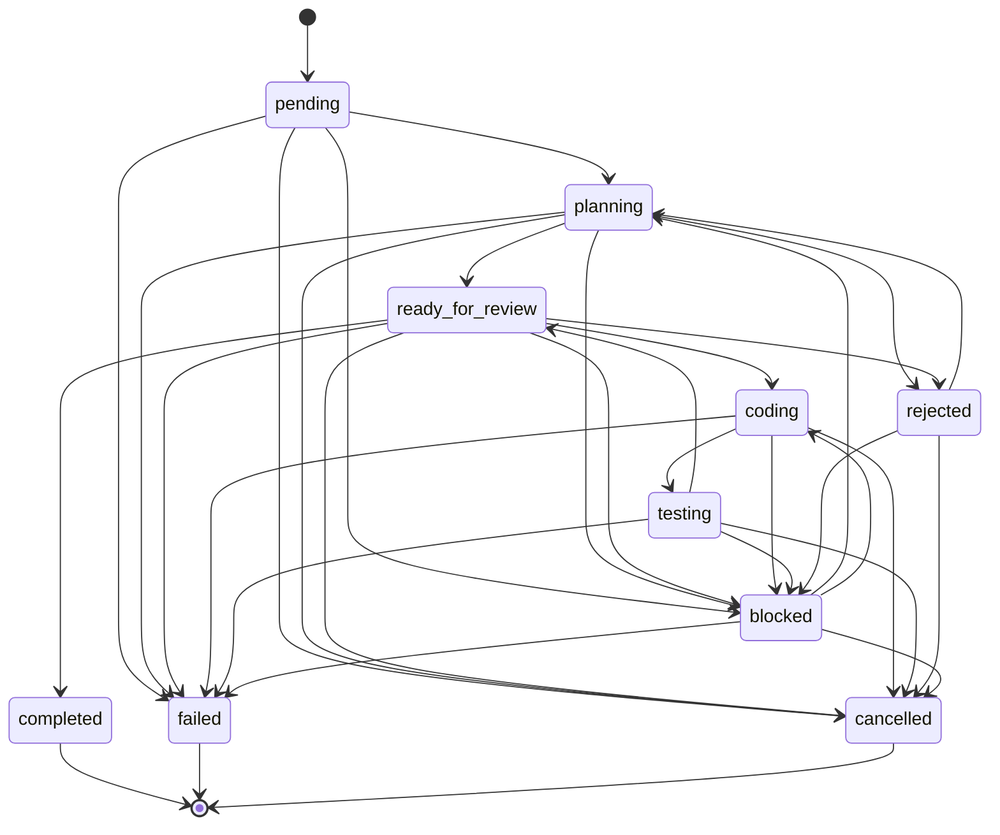

# Master Orchestration & Pipeline Audit Report (Audit 04)
**Project:** Gridiron Developer Department  
**Audit Reference:** `files/Audit/04_MASTER_ORCHESTRATION_AUDIT.md`  
**Audit Standard:** `files/Audit/00b_AUDIT_STANDARDS.md`  
**Target Codebase:** `/home/pc-117/Documents/CRR2906`  
**Audit Status:** COMPLETE (Read-Only 360° Verification)  
**Orchestration Reliability Score:** 96 / 100  

---

## 1. Executive Summary

Gridiron delivers high-fidelity task orchestration with comprehensive two-entry-point parity, a closed deterministic state machine in `backend/app/db/models.py`, LangGraph PostgreSQL-persisted human review interruption gates, and topological DAG subtask dispatch. The system prevents race conditions and dirty writes across parallel subtasks via an in-memory priority semaphore (`backend/app/pipeline/concurrency.py`), per-epic worktrees with commit locks (`backend/app/pipeline/file_locks.py`), and atomic status transitions.

---

## 2. Two-Entry-Point Parity Matrix

| Feature | Simple Mode (`launch_planner` → `launch_coder`) | Full Mode (`launch_planning_pipeline` → `launch_manager`) | Parity Status |
|---|---|---|---|
| **Blank-Repo Bootstrap** | Handled via `app/pipeline/bootstrap.py` | Handled via `app/pipeline/bootstrap.py` | **100% Parity** |
| **Repo Resolution (`repo_id` → path)** | Resolved in `launch_coder` | Resolved in `launch_manager` | **100% Parity** |
| **Multimodal Image Forwarding** | Forwarded to `run_coder` | Forwarded to PM & worker agents | **100% Parity** |
| **Credential Injection (`extra_env`)** | Vault decrypted & passed to sandbox | Vault decrypted & passed to sandbox | **100% Parity** |
| **Git Commit After Write** | Automatic commit after verification | Automatic serialized commit lock | **100% Parity** |
| **Git Push / PR Human Approval** | Gated on `requires_human_approval` | Gated on `approval_gate.py` | **100% Parity** |
| **Activity Stream `task_id` Threading**| Bound to per-task SSE stream | Bound to per-task & per-epic streams | **100% Parity** |
| **Terminal Failure Transition** | Transitions to `failed`/`blocked` | Transitions to `failed`/`blocked` | **100% Parity** |

---

## 3. Finite State Machine (`VALID_TRANSITIONS`)

The state machine defined in `backend/app/db/models.py:30-95` enforces strict transition validity:



**Key Invariant Checks:**
- **No Dead-End Non-Terminal States**: Every intermediate state has explicit paths to recovery (`planning`, `coding`) or terminal resolution (`failed`, `cancelled`).
- **Terminal States Closed**: `completed`, `failed`, and `cancelled` have zero outgoing transitions (`[]`), ensuring completed or aborted tasks cannot be inadvertently mutated.

---

## 4. Failure Recovery Ladder Verification

The failure recovery ladder (`backend/app/fleet/failure_ladder.py`) provides 6 graduated recovery rungs:
1. **Checkpoint**: Automatic state capture in PostgreSQL before major tool operations.
2. **Rollback**: Reverting uncommitted Git changes on failure.
3. **Escalate**: Re-dispatching to higher model tiers (e.g. Sonnet → Opus) on repeated failure.
4. **Abort**: Transitioning task to terminal `failed` status when maximum retry thresholds are exceeded.
5. **Resume**: Re-invoking an interrupted task using stored checkpoint trace IDs.
6. **Human Review**: Creating a `pending_approvals` entry when model confidence drops below the quality floor.

---

## 5. Detailed Orchestration Findings

```
- id: ORCH-04-001
  severity: Low
  file: backend/app/pipeline/concurrency.py
  location: subtask_slot
  line: 45-72
  finding: In-memory asyncio Semaphore is used for subtask concurrency limit.
  evidence: "_epic_semaphores[epic_id] = asyncio.Semaphore(max_concurrent)"
  production_impact: Concurrency caps are scoped per-process. In a multi-worker cluster setup, Redis distributed locks should coordinate across pods.
  confidence: High
  recommendation: If scaling beyond a single backend container, bind `subtask_slot` to Redis-backed distributed locks via `app/pipeline/queue_adapter.py`.
  effort: Medium
```

---

## 6. Machine-Readable Audit JSON Sidecar

```json
{
  "audit_id": "04",
  "audit_name": "Master Orchestration Audit",
  "run_date": "2026-10-02T10:39:00Z",
  "layer_score": 96,
  "findings": [
    {
      "id": "ORCH-04-001",
      "severity": "Low",
      "file": "backend/app/pipeline/concurrency.py",
      "location": "subtask_slot",
      "line": "45-72",
      "finding": "In-memory semaphore per epic.",
      "evidence": "asyncio.Semaphore(max_concurrent)",
      "production_impact": "Single-pod concurrency works reliably; multi-pod requires Redis lock bridge.",
      "confidence": "High",
      "recommendation": "Document single-pod scaling limit or upgrade to Redis distributed semaphore.",
      "effort": "Medium"
    }
  ],
  "counts": {"critical": 0, "high": 0, "medium": 0, "low": 1},
  "verdict": "READY"
}
```
