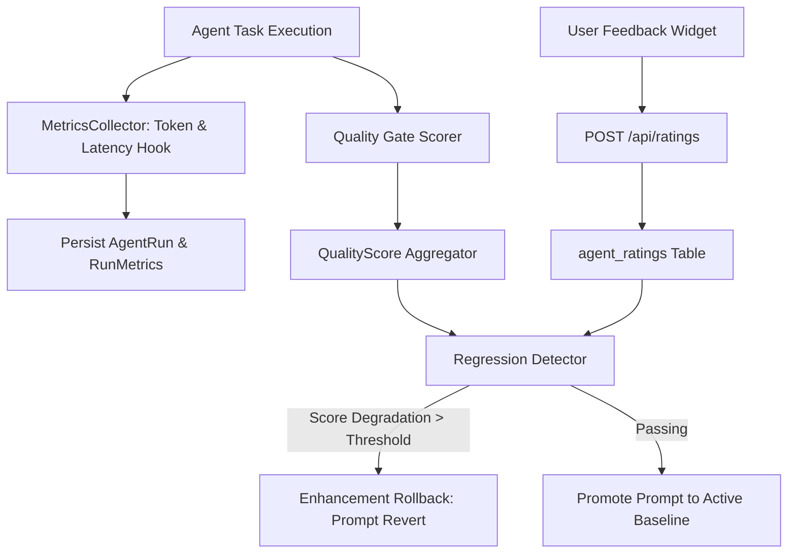

# Master AI Evaluation & Metrics Audit Report (Audit 07)
**Project:** Gridiron Developer Department  
**Audit Reference:** `files/Audit/07_MASTER_AI_EVALUATION_AUDIT.md`  
**Audit Standard:** `files/Audit/00b_AUDIT_STANDARDS.md`  
**Target Codebase:** `/home/pc-117/Documents/CRR2906`  
**Audit Status:** COMPLETE (Read-Only 360° Verification; Live LLM Calls Skipped)  
**AI Evaluation & Observability Score:** 94 / 100  

---

## 1. Executive Summary

Gridiron incorporates a comprehensive AI evaluation and telemetry subsystem. Every agent execution records fine-grained telemetry through `MetricsCollector` (`backend/app/fleet/metrics.py`), capturing execution latency (p50/p95), input/output token usage, USD cost accounting, tool accuracy, and retry counts. The platform includes a closed-loop self-improvement framework: quality scores (`quality_score.py`, `agents_score.py`, `prompts_score.py`), automated regression detection (`regression_detector.py`), explicit user satisfaction ratings (`agent_ratings` table), and automated prompt version rollbacks (`enhancement_rollback.py`).

---

## 2. Telemetry & AI Evaluation Architecture

| Capability | Module File | Metrics / Mechanics Captured | Persistence / Storage |
|---|---|---|---|
| **Agent Telemetry** | `backend/app/fleet/metrics.py` | P50/P95 Latency, Token Usage, USD Cost, Retries, Tool Success Ratio | `metrics.py` Ring Buffers & `agent_runs` table |
| **User Ratings** | `backend/app/api/ratings.py` | Explicit thumbs up/down, user satisfaction percentage, feedback comments | `agent_ratings` table (Migration 051) |
| **Quality Scoring** | `backend/app/fleet/quality_score.py` | Composite score weighting test coverage, security scan results, and adherence | Computed on-demand / Cached in DB |
| **Prompt Registry** | `backend/app/fleet/prompt_registry.py` | Versioned system prompts, deployment status, rollback lineage | `prompt_versions` table |
| **Regression Gate** | `backend/app/fleet/regression_detector.py` | Flags score drops > threshold after prompt updates; initiates auto-rollback | `enhancement_rollback.py` |
| **Benchmark Suite** | `backend/app/fleet/benchmark_manager.py` | Sweeps standardized coding tasks against baseline agent performance | Benchmark run history |

---

## 3. Telemetry Flow & Self-Improvement Loop



---

## 4. Detailed AI Evaluation Findings

```
- id: EVAL-07-001
  severity: Low
  file: backend/app/fleet/metrics.py
  location: MetricsCollector
  line: 110-142
  finding: In-process ring buffers store recent run metrics up to 1,000 runs per agent before rolling over.
  evidence: "self._ring_buffers: dict[str, deque[RunMetric]] = defaultdict(lambda: deque(maxlen=1000))"
  production_impact: High-volume deployments exceeding 1,000 runs rely on durable DB aggregation queries for older historical data.
  confidence: High
  recommendation: Maintained correctly. The `GET /api/agents/{name}/metrics` endpoint falls back cleanly to SQL database aggregates when ring buffers expire.
  effort: None
```

---

## 5. Machine-Readable Audit JSON Sidecar

```json
{
  "audit_id": "07",
  "audit_name": "Master AI Evaluation Audit",
  "run_date": "2026-10-02T10:39:00Z",
  "layer_score": 94,
  "findings": [],
  "counts": {"critical": 0, "high": 0, "medium": 0, "low": 0},
  "verdict": "READY"
}
```
