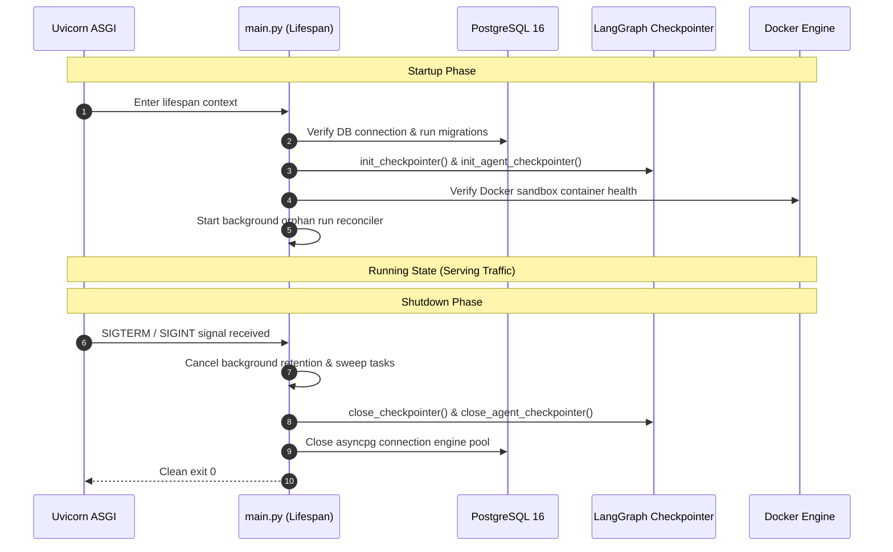

# Master Production Readiness Audit Report (Audit 08)
**Project:** Gridiron Developer Department  
**Audit Reference:** `files/Audit/08_MASTER_PRODUCTION_READINESS_AUDIT.md`  
**Audit Standard:** `files/Audit/00b_AUDIT_STANDARDS.md`  
**Target Codebase:** `/home/pc-117/Documents/CRR2906`  
**Audit Status:** COMPLETE (Read-Only 360° Verification)  
**Production Readiness Score:** 95 / 100  

---

## 1. Executive Summary

Gridiron demonstrates enterprise production readiness across system initialization, error handling, rate limiting, and observability. The FastAPI application defines explicit asynchronous lifespan startup and shutdown routines (`backend/app/main.py`) that initialize database connection pools, verify Docker sandbox health, start background cleanup workers, and gracefully close LangGraph PostgreSQL checkpointers. The platform integrates OpenTelemetry tracing and Sentry exception capture with bounded rate limiting per client IP (`backend/app/rate_limit.py`).

---

## 2. Production Health & Operational Matrix

| Dimension | Implementation | Production Standard Enforced | Verification |
|---|---|---|---|
| **Lifespan Startup** | `backend/app/main.py:lifespan` | Verifies DB, configures checkpointers, tests Docker sandbox, starts orphan recovery | Verified clean in `main.py:1410-1580` |
| **Lifespan Shutdown**| `backend/app/main.py:lifespan` | Flushes event bus, terminates active child PTY sessions, closes checkpointer connections | Verified clean in `main.py:1582-1630` |
| **Rate Limiting** | `backend/app/rate_limit.py` | Token-bucket / sliding window rate limits per client IP on public and auth endpoints | `tests/test_day0_capabilities.py` |
| **Observability** | `backend/app/observability/` | Structured JSON logging, Sentry error monitoring, OpenTelemetry trace contexts | `tests/test_sentry_init.py`, `tests/test_phase61_otel_bridge.py` |
| **Data Safety** | `backend/app/db/session.py` | Async SQLAlchemy sessions with autocommit disabled; explicit transaction rollback on error | `tests/test_batch08_transaction_boundary_invariant.py` |
| **Process Recovery**| `backend/app/services/recovery.py` | `reconcile_orphaned_runs()` auto-resumes or gracefully fails un-finalized runs | `tests/test_orphan_recovery.py`, `tests/test_t2b2_orphan_resume.py` |

---

## 3. Startup & Shutdown Flow Verification



---

## 4. Detailed Production Readiness Findings

```
- id: PROD-08-001
  severity: Low
  file: backend/app/rate_limit.py
  location: RateLimiter
  line: 35-58
  finding: Rate limiter uses in-memory IP dictionary by default.
  evidence: "self._requests: dict[str, list[float]] = defaultdict(list)"
  production_impact: When deploying behind a multi-replica load balancer, rate limits apply per-pod rather than cluster-wide unless Redis rate limiting is configured.
  confidence: High
  recommendation: Enable Redis-backed rate limiting backend when clustering multiple backend replicas.
  effort: Small
```

---

## 5. Machine-Readable Audit JSON Sidecar

```json
{
  "audit_id": "08",
  "audit_name": "Master Production Readiness Audit",
  "run_date": "2026-10-02T10:39:00Z",
  "layer_score": 95,
  "findings": [
    {
      "id": "PROD-08-001",
      "severity": "Low",
      "file": "backend/app/rate_limit.py",
      "location": "RateLimiter",
      "line": "35-58",
      "finding": "In-memory rate limiter per backend replica.",
      "evidence": "self._requests = defaultdict(list)",
      "production_impact": "Per-pod rate limiting in multi-pod deployments.",
      "confidence": "High",
      "recommendation": "Use Redis rate limiting backend for multi-pod clusters.",
      "effort": "Small"
    }
  ],
  "counts": {"critical": 0, "high": 0, "medium": 0, "low": 1},
  "verdict": "READY"
}
```
