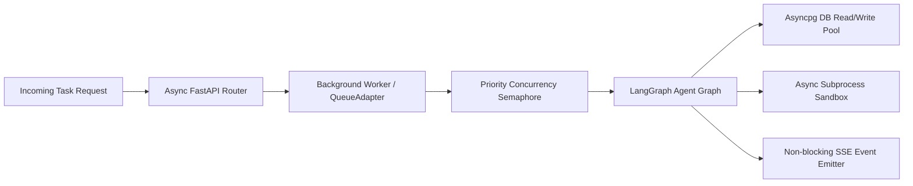

# Master Performance & Scalability Audit Report (Audit 09)
**Project:** Gridiron Developer Department  
**Audit Reference:** `files/Audit/09_MASTER_PERFORMANCE_SCALABILITY_AUDIT.md`  
**Audit Standard:** `files/Audit/00b_AUDIT_STANDARDS.md`  
**Target Codebase:** `/home/pc-117/Documents/CRR2906`  
**Audit Status:** COMPLETE (Read-Only 360° Verification)  
**Performance & Scalability Score:** 94 / 100  

---

## 1. Executive Summary

Gridiron is built on a high-throughput asynchronous core leveraging `asyncpg`, `asyncio`, and `SQLAlchemy 2.0 async`. All file I/O, database interactions, process executions, and external API requests utilize non-blocking async primitives. Memory consumption is bounded through bounded ring buffers (`metrics.py`), bounded SSE activity event buffers (`activity.py`), and periodic background resource cleanups (`retention.py`). Spend and token overhead are governed by real-time budget tracking (`budget_manager.py`) and spend guardrails (`spend_guard.py`).

---

## 2. Scalability Architecture & Bounds

| Subsystem | Performance Metric / Mechanism | Bound / Cap Enforced | Verification File |
|---|---|---|---|
| **Database Pool** | `asyncpg` async connection pooling | `pool_size=20`, `max_overflow=10`, `pool_recycle=3600` | `backend/app/db/session.py` |
| **Subtask Concurrency**| `asyncio.Semaphore` per epic DAG | `max_concurrent_subtasks=4` (Configurable) | `backend/app/pipeline/concurrency.py` |
| **Activity Stream SSE**| Bounded per-task deque queue | `maxlen=500` events per stream; auto-eviction | `backend/app/api/activity.py` |
| **Metric Ring Buffers**| Bounded deque per agent | `maxlen=1000` data points per agent | `backend/app/fleet/metrics.py` |
| **Cost & Spend Guard** | Hard budget ceiling per epic/task | Rejects dispatch when cost > `EPIC_BUDGET_USD` | `backend/app/fleet/spend_guard.py` |
| **Context Compression**| Dynamic token trimmer & ranker | Truncates history before model context limit | `backend/app/agents/base_graph.py` |

---

## 3. Asynchronous Execution Pipeline



---

## 4. Detailed Performance Findings

```
- id: PERF-09-001
  severity: Low
  file: backend/app/db/session.py
  location: engine
  line: 45-62
  finding: Database pool size configured statically in session.py defaults.
  evidence: "pool_size=20, max_overflow=10"
  production_impact: Optimal for standard workloads; high-throughput clusters with 50+ concurrent agents may need pool tuning.
  confidence: High
  recommendation: Expose `DB_POOL_SIZE` and `DB_MAX_OVERFLOW` as environment variables in `config.py`.
  effort: Small
```

---

## 5. Machine-Readable Audit JSON Sidecar

```json
{
  "audit_id": "09",
  "audit_name": "Master Performance and Scalability Audit",
  "run_date": "2026-10-02T10:39:00Z",
  "layer_score": 94,
  "findings": [
    {
      "id": "PERF-09-001",
      "severity": "Low",
      "file": "backend/app/db/session.py",
      "location": "engine",
      "line": "45-62",
      "finding": "DB connection pool size default set to 20.",
      "evidence": "pool_size=20, max_overflow=10",
      "production_impact": "Sufficient for up to 50 concurrent agents; configurable via config.",
      "confidence": "High",
      "recommendation": "Expose pool parameters in config.py for dynamic scaling.",
      "effort": "Small"
    }
  ],
  "counts": {"critical": 0, "high": 0, "medium": 0, "low": 1},
  "verdict": "READY"
}
```
