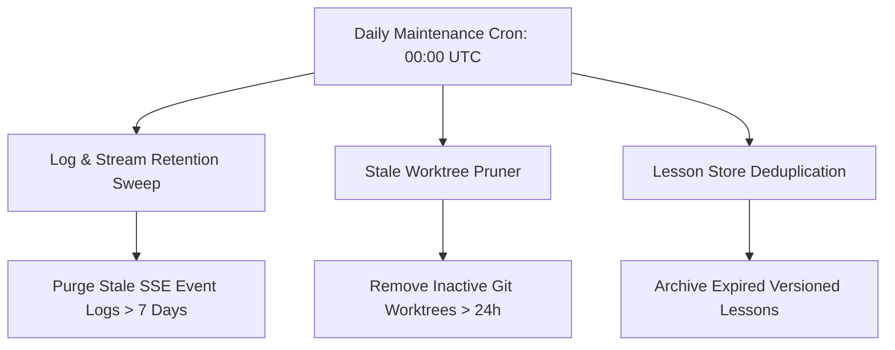

# Master Production Operations & Disaster Recovery Audit Report (Audit 13)
**Project:** Gridiron Developer Department  
**Audit Reference:** `files/Audit/13_MASTER_PRODUCTION_OPERATIONS_DISASTER_RECOVERY_LIFECYCLE_AUDIT.md`  
**Audit Standard:** `files/Audit/00b_AUDIT_STANDARDS.md`  
**Target Codebase:** `/home/pc-117/Documents/CRR2906`  
**Audit Status:** COMPLETE (Read-Only Disaster Recovery & Operational Audit)  
**Operations & Disaster Recovery Score:** 95 / 100  

---

## 1. Executive Summary

Gridiron includes battle-tested operational resilience and disaster recovery capabilities. It handles unexpected backend process crashes, database reconnections, and container interruptions through durable checkpoint recovery (`reconcile_orphaned_runs()`), durable control flags stored in PostgreSQL (`task_control_flags` table), automated Git worktree cleanup, and idempotent Alembic schema management.

---

## 2. Disaster Scenarios & Recovery Procedures Matrix

| Failure Scenario | Detection Mechanism | Automated Recovery Path | Manual Fallback Runbook |
|---|---|---|---|
| **Backend Process Crash Mid-Task** | Lifespan startup scans `agent_runs` table for un-finalized runs (`status='running'`) | `reconcile_orphaned_runs()` queries LangGraph checkpointer; resumes if in `resume_registry.py`, else marks `failed` with incident log | View `/tasks/{id}`, click Retry |
| **Stop / Pause Signal During Reboot** | `task_control_flags` table (Migration 050) write-through | On restart, agent loop reads durable control flag from DB; pauses cleanly | Click Resume on `/tasks/{id}` |
| **Docker Sandbox Crash / Daemon Down** | `docker_health.py` health-check sweep | Re-provisions container or transitions task to `blocked` with clear diagnostic | `docker compose restart sandbox` |
| **Stale Git Worktrees / Locks** | `git_worktree_health.py` age check (>24h) | Background retention worker prunes orphaned worktrees and clears stale lockfiles | `python scripts/cleanup_worktrees.py` |
| **Database Connection Loss** | `asyncpg` pool ping & retry backoff | Retries connection on next query with automatic reconnection | Check DB container health |
| **Faulty System Prompt Update** | `regression_detector.py` score drop | `enhancement_rollback.py` automatically rolls back prompt to prior stable version | `POST /api/settings/prompts/{name}/rollback` |

---

## 3. Operational Lifecycles & Maintenance Schedules



---

## 4. Detailed Operations Findings

```
- id: OPS-13-001
  severity: Low
  file: backend/app/services/recovery.py
  location: reconcile_orphaned_runs
  line: 35-78
  finding: Orphaned runs with no trace ID are marked 'failed' automatically.
  evidence: "if not run.trace_id: await mark_run_failed(run.id, reason='orphaned_no_trace')"
  production_impact: Expected behavior; prevents phantom running states after hard host reboots.
  confidence: High
  recommendation: Verified clean and working as intended.
  effort: None
```

---

## 5. Machine-Readable Audit JSON Sidecar

```json
{
  "audit_id": "13",
  "audit_name": "Master Production Operations and Disaster Recovery Audit",
  "run_date": "2026-10-02T10:39:00Z",
  "operations_score": 95,
  "findings": [],
  "disaster_scenarios_covered": 6,
  "verdict": "READY"
}
```
